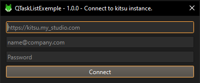
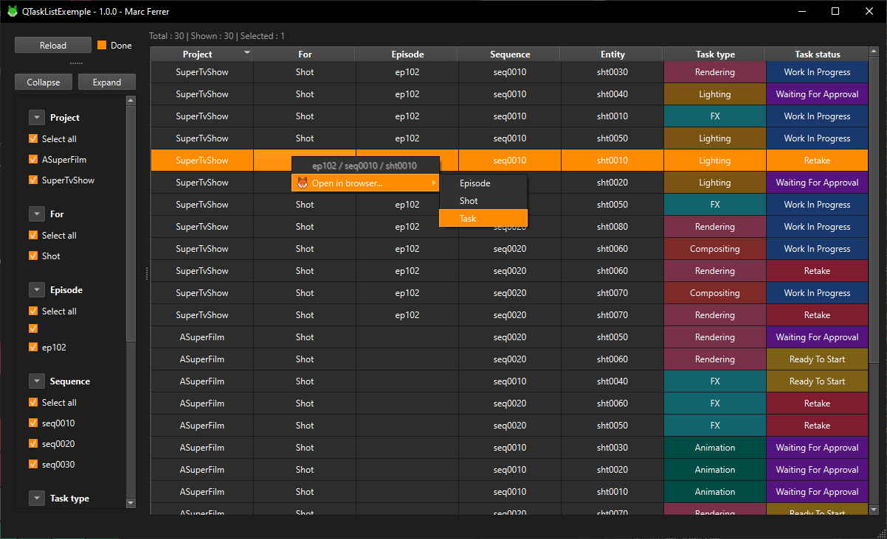
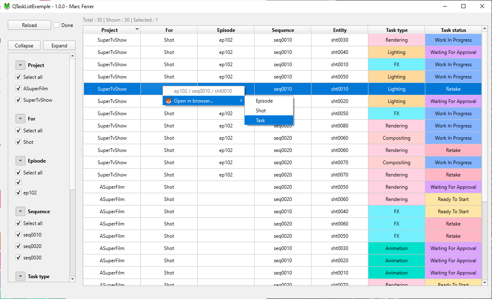

# QTastList-Exemple
The application connect to a running [Kitsu](https://www.cg-wire.com/fr/kitsu) instance, to display user tasks.
It uses [QTaskList](https://github.com/Elsombrerobot/QTaskList) as a submodule for the main filtering widget, and displaying widget.

## Features

- Query a kitsu instance for user tasks or done tasks.
- Display tasks in a list fashion.
- Filter and sort your tasks as preferred.
- Dark / light theme following OS theme.
- Heavy use of Qt framework, including for network requests.
- Open a task / asset / episode or production in kitsu.

# Screenshots
- Connection box

- Application

# Requirements

## Libraries

- CMake 3.16 ([Qt with CMake](https://doc.qt.io/qt-6/cmake-get-started.html))
- [Qt 6.6.2](https://doc.qt.io/archives/qt-6.6/reference-overview.html)

## Platforms

- Tested only for **windows 10 x64**.
- Build tested only for **msvc community 2022**.
- Code only tested with **VC 17**.

## Other

- A Kitsu instance to query, tested with version `0.19.15` of Zou api.
- I recommend https://gitlab.com/mathbou/docker-cgwire, to avoid inputing sensitive informations into a random git project...

# Compile
- Make sure  Qt **msvc2019** component is installed, at this time this is latest.
- Make sure Qt installation is in `Path` varenv, example : `D:\Qt\6.6.2\msvc2019_64\bin`.
- Create a directory for the project `mkdir QTaskListProject` and `cd QTaskListProject`.
- Clone the modules and its submodule : `git clone https://github.com/Elsombrerobot/QTaskList-Exemple --recurse-submodules`
- `cd QTaskList-Exemple`
- Run `make.bat` with `make`, it will create an out of source build in `build_windows.`
- Create the executable : 
- Via **MSVC**
	- Open `build_windows/QTaskListExemple.sln` with MSVC
	- Find the `INSTALL` project in the solution explorer, **right click** and **build**.. 
- Via **cmd**
	- Run `install.bat` with `install release` (or `debug`)
- Execute `build_windows/bin/QTaskListExemple/bin/QTaskListExemple.exe`.

`build_windows/bin/QTaskListExemple` is the standalone app folder.

# Run
If you have correctly setup your `Path` for Qt, you can debug and run inside **MSVC**.

# Todo
* [ ] Upload executable.
* [ ] Tag versions, starting a first realease.